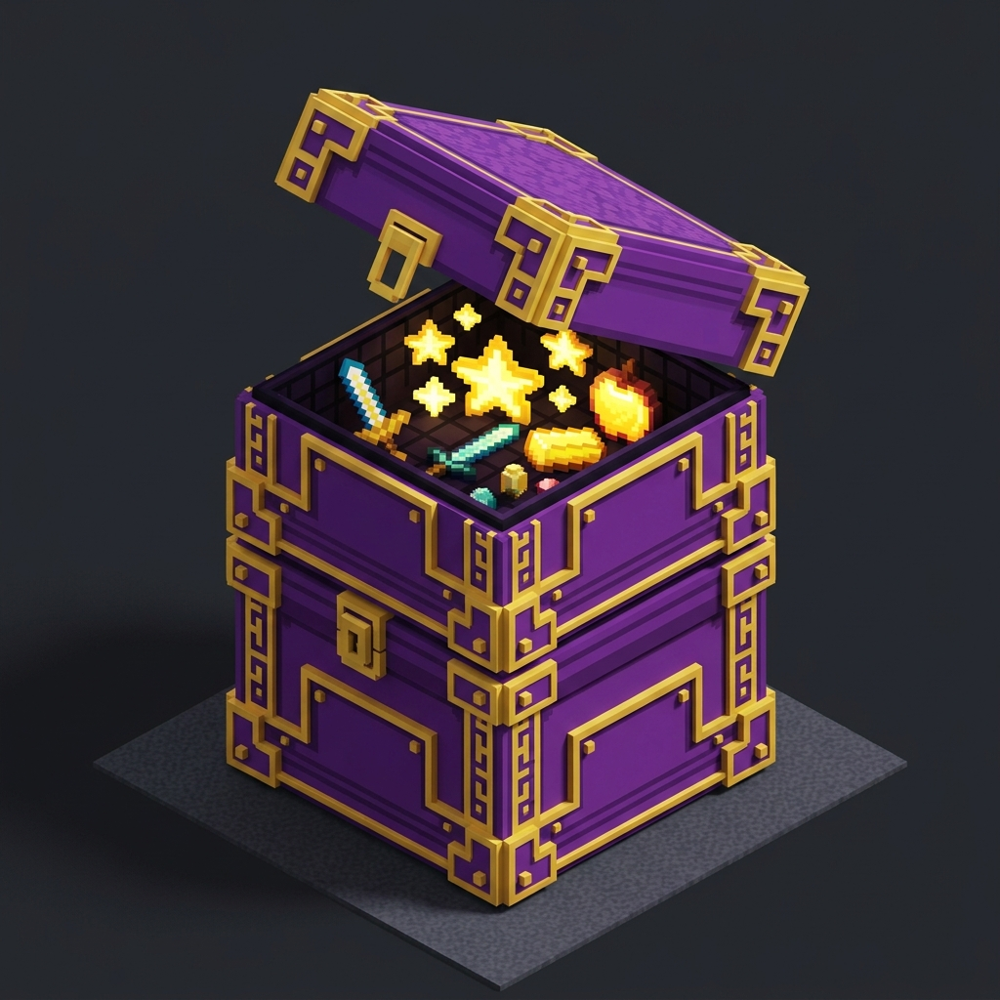

# Bigger Shulker Boxes 📦

**Bigger Shulker Boxes** expands vanilla Minecraft Shulker Box container storage from **27 slots (3 rows)** to **54 slots (6 rows)** — doubling portable inventory capacity to match a double chest!

From the creator of [Bigger Ender Chest](https://modrinth.com/mod/bigger-ender-chest) and [Barrel Extender](https://modrinth.com/mod/barrel-extender), completing the Vanilla+ Double Storage Trilogy.

---

## ✨ Features

- **Double Capacity**: Every Shulker Box now holds **54 slots (6 rows)** instead of 27.
- **100% Vanilla Equivalent**: Uses the clean, native 6-row container UI. No foreign menus or bloat.
- **Hopper & Automation Support**: Hoppers, droppers, and automation pipes can insert and extract across all 54 slots.
- **Safe Item Persistence**: When broken, all 54 slots are saved directly into the Shulker Box item and restored when placed.
- **World Preservation**: Installing on an existing world safely keeps all previous items in the top 3 rows.
- **Zero Extra Dependencies**: Pure Fabric mixin. Does not require bulky frameworks.

---

## 🛠️ Installation

1. Install [Fabric Loader](https://fabricmc.net/use/installer/) for Minecraft Java Edition.
2. Download **Bigger Shulker Boxes** `.jar` from [Modrinth](https://modrinth.com/mod/bigger-shulker-boxes) or [GitHub Releases](https://github.com/antaripnandi/bigger-shulker-boxes/releases).
3. Place the `.jar` file into your `.minecraft/mods` folder.
4. Launch the game and enjoy 54 slots of portable storage!

---

## ⚠️ Notes Before Uninstalling

If you ever uninstall the mod, items in rows 4–6 (slots 28–54) will not be visible in vanilla Minecraft. Always remove items from the bottom rows before removing any container expansion mod.

---

## 📄 License

Available under the [MIT License](LICENSE).
